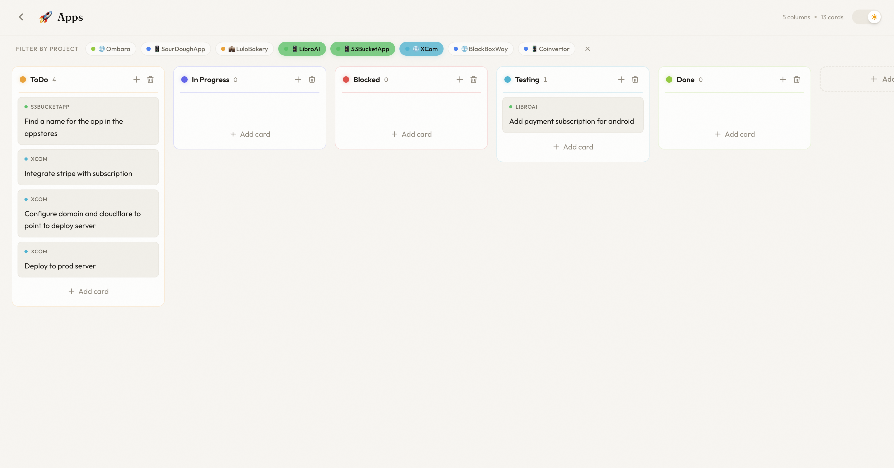

<p align="center">
  
</p>

<h1 align="center">Flowmancer</h1>

<p align="center">
  <strong>A beautiful, open-source kanban board with Firebase backend and AI-ready architecture.</strong>
</p>

<p align="center">
  
  
  
  
  
</p>

<p align="center">
  <a href="https://flow-mancer.vercel.app/">Live Demo</a>
</p>

<p align="center">
  
</p>

---

## Table of Contents

- [What is Flowmancer?](#what-is-flowmancer)
  - [Features](#features)
  - [Tech Stack](#tech-stack)
- [Getting Started](#getting-started)
- [Project Structure](#project-structure)
- [Scripts](#scripts)
- [AI Integration (MCP Server)](#ai-integration-mcp-server)
  - [Tools](#tools)
  - [Setup](#setup)
  - [Connecting an MCP client](#connecting-an-mcp-client)
  - [Agents Monitor](#agents-monitor-live-which-agents-are-running-view)
- [Securing for Production](#securing-for-production)
- [Contributing](#contributing)
- [License](#license)

---

## What is Flowmancer?

Flowmancer is an open-source, self-hostable Trello alternative for teams and individuals who want full control over their task management. It covers the kanban essentials (multiple boards, drag-and-drop cards, projects, reusable labels, image attachments, and a polished dark/light theme), backs them with real-time Firebase sync, and adds board sharing with role-based access (owner / editor / viewer).

What sets it apart is a built-in **Model Context Protocol (MCP) server**: it turns your boards into a surface that AI agents can operate directly, listing, creating, moving, assigning, and deleting tickets and projects through the same permission model as the web app. A live **Agents Monitor** on the Dashboard then shows which agents are working, in real time, grouped by project.

### Features

- **Kanban boards** -- Create multiple boards with custom emoji icons
- **Custom columns** -- Add, rename, reorder, and color-code columns (15 colors)
- **Cards** -- Create, edit, drag-and-drop between columns, add descriptions and labels
- **Label management** -- Define and reuse labels across cards
- **Image attachments** -- Upload images to cards via Firebase Storage with lightbox preview
- **Projects** -- Group cards across boards by project with color-coded badges
- **Board sharing** -- Invite members and assign roles (owner / editor / viewer) per board
- **Ticket assignment** -- Assign cards to board members
- **AI agents (MCP server)** -- A Model Context Protocol server exposes boards, tickets, and projects to AI models so they can list, create, move, update, assign, and delete tickets (and create/update/delete projects)
- **Agents Monitor** -- A live Dashboard panel showing which AI agents are currently working, grouped by project
- **Dark / Light theme** -- Toggle between a deep "Dark Forge" theme and a warm pastel light mode
- **Authentication** -- Google sign-in and email/password via Firebase Auth
- **Real-time sync** -- All data syncs instantly via Firestore `onSnapshot` listeners
- **User-scoped data** -- Each user only sees their own boards, projects, and shared boards
- **Audit trail** -- Cards track created by, created at, last updated, and updated by
- **Responsive** -- Works on desktop and tablet

### Tech Stack

| Layer | Technology |
|-------|-----------|
| Framework | Vue 3 (Composition API + `<script setup>`) |
| Styling | Tailwind CSS v4 |
| State | Pinia |
| Routing | Vue Router 4 |
| Backend | Firebase (Firestore + Storage + Auth) |
| AI integration | MCP server (Node, ESM) on the Firebase Admin SDK |
| Build | Vite |
| Drag & Drop | Native HTML5 API (zero dependencies) |

---

## Getting Started

### Prerequisites

- [Node.js](https://nodejs.org/) 18+
- A [Firebase](https://console.firebase.google.com/) project

### 1. Clone the repo

```bash
git clone https://github.com/YOUR_USERNAME/flowmancer.git
cd flowmancer
npm install
```

### 2. Set up Firebase

#### Create a Firebase project

1. Go to [Firebase Console](https://console.firebase.google.com/)
2. Click **Add project** and follow the wizard
3. Once created, click the **Web** icon (`</>`) to register a web app
4. Copy the `firebaseConfig` object it gives you

#### Enable services

In your Firebase project, enable these three services:

**Firestore Database**

1. Go to **Build > Firestore Database**
2. Click **Create database**
3. Choose **Start in test mode** (you can lock it down later)
4. Select a region close to your users

**Storage**

1. Go to **Build > Storage**
2. Click **Get started**
3. Choose **Start in test mode**

**Authentication**

1. Go to **Build > Authentication > Sign-in method**
2. Enable **Email/Password**
3. Enable **Google** (select a support email when prompted)

#### Create Firestore indexes

Flowmancer uses composite queries that require indexes. The easiest way:

1. Start the app and open the browser console
2. You'll see errors with direct links to create the required indexes
3. Click each link and hit **Create index** in Firebase Console

Or create them manually in **Firestore > Indexes**:

| Collection | Fields |
|-----------|--------|
| `boards` | `userId` (Asc) + `createdAt` (Asc) |
| `projects` | `userId` (Asc) + `createdAt` (Asc) |

### 3. Configure environment

```bash
cp .env.example .env
```

Fill in your Firebase config values in `.env`:

```env
VITE_FIREBASE_API_KEY=your-api-key
VITE_FIREBASE_AUTH_DOMAIN=your-project.firebaseapp.com
VITE_FIREBASE_PROJECT_ID=your-project-id
VITE_FIREBASE_STORAGE_BUCKET=your-project.firebasestorage.app
VITE_FIREBASE_MESSAGING_SENDER_ID=your-sender-id
VITE_FIREBASE_APP_ID=your-app-id
```

You can find all these values in **Firebase Console > Project Settings > Your apps > Web app**.

> The root `.env` is shared by the whole project. The optional MCP server reads its
> own keys (`FIREBASE_PROJECT_ID`, `GOOGLE_APPLICATION_CREDENTIALS`, `FLOWMANCER_API_KEY`)
> from this same file. See [AI Integration](#ai-integration-mcp-server) below if you
> want to enable AI access. `.env.example` documents every key.

### 4. Run the app

```bash
npm run dev
```

Open [http://localhost:5173](http://localhost:5173) and sign in.

---

## Project Structure

```
src/
├── components/
│   ├── AddColumnButton.vue    # "Add column" inline form
│   ├── AgentMonitor.vue       # Live "AI agents working" panel (Dashboard)
│   ├── CardModal.vue          # Card editor with images, labels, projects, assignee, metadata
│   ├── EditBoardModal.vue     # Board name/emoji editor
│   ├── KanbanCard.vue         # Card component with cover image + project badge
│   ├── KanbanColumn.vue       # Column with color picker, drag-and-drop cards
│   ├── ManageLabelsModal.vue  # Create/edit reusable card labels
│   ├── ProjectModal.vue       # Create/edit project modal
│   ├── ShareBoardModal.vue    # Invite members + set roles (owner/editor/viewer)
│   └── ThemeToggle.vue        # Dark/light theme switch
├── stores/
│   ├── agents.js              # Live agent sessions (Agents Monitor)
│   ├── auth.js                # Firebase Auth (Google + email/password)
│   ├── board.js               # Boards, columns, cards CRUD + members/roles + image uploads
│   ├── projects.js            # Projects CRUD
│   ├── theme.js               # Theme persistence
│   └── users.js               # User directory (member avatars + share search)
├── views/
│   ├── Board.vue              # Kanban board view
│   ├── Dashboard.vue          # Home: agents monitor + projects list + boards grid
│   └── Login.vue              # Auth page (login/register)
├── App.vue                    # Root component with auth gating
├── firebase.js                # Firebase initialization
├── main.js                    # App entry, router, auth guard
└── style.css                  # Tailwind + theme variables + animations

mcp-server/                    # MCP server exposing boards/tickets/projects to AI (see "AI Integration" below)
├── src/                       # Tools + board/agent services on the Firebase Admin SDK
└── scripts/                   # API-key management + agent presence hook
```

---

## Scripts

| Command | Description |
|---------|-------------|
| `npm run dev` | Start development server |
| `npm run build` | Build for production |
| `npm run preview` | Preview production build locally |

---

## AI Integration (MCP Server)

Flowmancer ships an optional **MCP ([Model Context Protocol](https://modelcontextprotocol.io)) server**
in `mcp-server/` that lets AI agents (Claude Desktop, Cursor, Claude Code, etc.)
act on your boards: list boards, create tickets, move them between columns, and
update, assign, or delete them, plus create and manage projects.

It talks to Firestore through the **Firebase Admin SDK** using a service account,
and scopes every action to a board member identified by an **API key**. The same
ticket logic the web app uses (`src/stores/board.js`) is mirrored in
`mcp-server/src/board-service.js`, so AI-created tickets are indistinguishable
from UI-created ones.

### Tools

| Tool | What it does |
|---|---|
| `whoami` | Returns the member the API key acts as |
| `list_boards` | All boards you're a member of, with columns + card counts |
| `list_projects` | Your projects (id, name, emoji, color) for linking tickets |
| `create_project` | Create a project (name, optional color + emoji) |
| `update_project` | Edit a project's name / color / emoji |
| `delete_project` | Delete a project you own |
| `list_agent_sessions` | Currently-active AI agent sessions (the agents monitor) |
| `get_board` | One board with every column and ticket (to discover ids) |
| `create_ticket` | Create a card in a column (by id or name) |
| `move_ticket` | Move a card to another column (change status) |
| `update_ticket` | Edit title / description / labels / project |
| `assign_ticket` | Assign to a member (by uid or email), or unassign |
| `delete_ticket` | Delete a card |

Mutating tools require the API key to have the `write` scope and the member to
have `owner` or `editor` role on the board (viewers are read-only), matching the
web app's permission model.

### Setup

**1. Create a service account (one time).** A service account lets the server act
on Firestore as an admin (it bypasses the per-user security rules the web app
relies on).

1. Open the [Firebase Console](https://console.firebase.google.com/) and select
   your project.
2. Click the gear icon → **Project settings** → **Service accounts** tab.
3. Make sure **Firebase Admin SDK** is selected, then click
   **Generate new private key** → **Generate key**.
4. A JSON file downloads. Treat it like a password: it grants full read/write to
   your database. Move it into `mcp-server/` named `service-account.json`:
   ```bash
   mv ~/Downloads/your-project-firebase-adminsdk-*.json mcp-server/service-account.json
   chmod 600 mcp-server/service-account.json
   ```
   `service-account.json` and `.env` are gitignored, so they're never committed.
   If a key ever leaks, revoke it in the same **Service accounts** tab and
   generate a new one.

**2. Install.**
```bash
cd mcp-server
npm install
```

**3. Configure credentials.** The MCP server reads the **repo root `.env`** (the
same file the web app uses). Set these keys in it:
```bash
FIREBASE_PROJECT_ID=your-project-id
# Absolute path so it resolves from any working directory:
GOOGLE_APPLICATION_CREDENTIALS=/absolute/path/to/vibe-board/mcp-server/service-account.json
```
(Alternatively, paste the whole JSON into a single-line
`FIREBASE_SERVICE_ACCOUNT='{...}'` variable.) The `npm run` scripts in
`mcp-server/` load the root `.env` automatically via Node's `--env-file=../.env`.

**4. Create an API key for a user.** The key maps to a Firebase uid (a real board
member). Find the uid in the `users` collection, or pass the user's email:
```bash
npm run create-key -- --email you@example.com --name "My AI agent"
# read-only key:
npm run create-key -- --email you@example.com --read-only
```
The plaintext key (`fmk_live_...`) is printed once. Only its SHA-256 hash is
stored in the `apiKeys` collection. Put it in the root `.env` as
`FLOWMANCER_API_KEY` and/or in your MCP client config. Revoke later with
`npm run revoke-key -- --keyId <id>`.

### Connecting an MCP client

Add to your MCP client config (example for Claude Desktop /
`claude_desktop_config.json`; Claude Code uses the same shape):

```json
{
  "mcpServers": {
    "flowmancer": {
      "command": "node",
      "args": ["/absolute/path/to/vibe-board/mcp-server/src/server.js"],
      "env": {
        "FIREBASE_PROJECT_ID": "your-project-id",
        "GOOGLE_APPLICATION_CREDENTIALS": "/absolute/path/to/service-account.json",
        "FLOWMANCER_API_KEY": "fmk_live_xxxxxxxxxxxxxxxxxxxx"
      }
    }
  }
}
```

Each connected client uses its own API key, so different agents can act as
different members with different scopes.

#### Example flow for an agent

1. `list_boards` → pick a board id
2. `get_board { boardId }` → read column names + card ids
3. `create_ticket { boardId, column: "To Do", title: "Fix login bug" }`
4. `move_ticket { boardId, cardId, toColumn: "In Progress" }`
5. `assign_ticket { boardId, cardId, assigneeEmail: "dev@example.com" }`

### Agents Monitor (live "which agents are running" view)

The Dashboard has an **Agents** section showing, in real time, which of your
repos currently have an AI agent working. It is fed by lifecycle **hooks** that
call a small CLI (`mcp-server/scripts/agent-hook.js`) which writes presence
records to the `agentSessions` collection using the same service account + API
key. When the agent finishes, the hook clears the record and the card disappears.

**1. Tell each repo which project it belongs to.** Drop a `.flowmancer` file at
the root of every repo you work in. Use `projectId` (from `list_projects`) or a
`project` name:

```json
{ "projectId": "w7Xk3x4nALxfKI2aPYny" }
```
```json
{ "project": "ReadLens" }
```

The hook searches upward from the working directory, so a file at the repo root
covers all subdirectories. A repo with no `.flowmancer` is simply not tracked.

**2. Wire the hooks.** The CLI takes one subcommand and reads the hook's JSON from
stdin: `start` (agent began a prompt), `beat` (throttled heartbeat), and `stop`
(agent finished). It self-loads the repo root `.env` for credentials, so the only
requirement is an absolute path to the script. **Claude Code**
(`~/.claude/settings.json`):

```json
{
  "hooks": {
    "UserPromptSubmit": [
      { "hooks": [ { "type": "command", "command": "node /ABS/PATH/vibe-board/mcp-server/scripts/agent-hook.js start" } ] }
    ],
    "Stop": [
      { "hooks": [ { "type": "command", "command": "node /ABS/PATH/vibe-board/mcp-server/scripts/agent-hook.js stop" } ] }
    ]
  }
}
```

For **Codex** (or any other agent), call the same script from its equivalent
start/stop hooks and pass `--agent codex` so the monitor labels it correctly.
Without stdin you can pass everything via flags:
`--session <id> --project-id <id> --task "what it's doing" --cwd <dir>`.

The hook is fail-safe: any error is printed to stderr and it still exits 0, so a
misconfiguration never blocks your agent. If an agent crashes without firing
`stop`, its heartbeat goes stale and the web app marks the card "stale" (and
stops counting it as working) after a few minutes.

---

## Securing for Production

The setup instructions use **test mode** (open access). The repo already ships
production-ready rules in [`firestore.rules`](firestore.rules) covering the
members/roles model, projects, user profiles, API keys, and agent sessions.
Deploy that file (Firebase Console > Firestore > Rules, or the Firebase CLI)
instead of staying in test mode. The board rules look like this:

### Firestore Rules

```javascript
rules_version = '2';
service cloud.firestore {
  match /databases/{database}/documents {
    // Boards: readable by any member; mutable by owner/editor; deletable by owner.
    match /boards/{boardId} {
      allow read: if request.auth != null
        && (request.auth.uid == resource.data.userId
            || request.auth.uid in resource.data.members);
      allow create: if request.auth.uid == request.resource.data.userId
        && request.auth.uid in request.resource.data.members;
      allow update: if request.auth.uid in resource.data.members
        && (resource.data.roles[request.auth.uid] in ['owner', 'editor']
            || request.auth.uid == resource.data.userId);
      allow delete: if request.auth.uid == resource.data.userId;
    }
    // Projects: private to their owner.
    match /projects/{projectId} {
      allow read, update, delete: if request.auth != null
        && resource.data.userId == request.auth.uid;
      allow create: if request.auth != null
        && request.auth.uid == request.resource.data.userId;
    }
    // See firestore.rules for users, apiKeys, and agentSessions.
  }
}
```

### Storage Rules

```javascript
rules_version = '2';
service firebase.storage {
  match /b/{bucket}/o {
    match /boards/{boardId}/{allPaths=**} {
      allow read, write: if request.auth != null;
    }
  }
}
```

---

## Contributing

Contributions are welcome! Please open an issue first to discuss what you'd like to change.

1. Fork the repo
2. Create a feature branch (`git checkout -b feature/amazing-feature`)
3. Commit your changes
4. Push to the branch (`git push origin feature/amazing-feature`)
5. Open a Pull Request

---

## License

[MIT](LICENSE)

---

<p align="center">
  Built with Vue, Tailwind, Firebase, and flow state.
</p>
